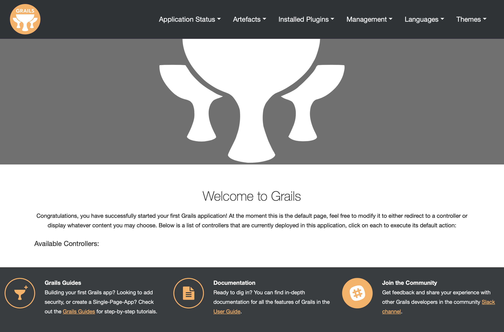

# Grails Web Bootstrap Profile

A Grails Profile for creating standard Grails web applications, with popular CSS framework **Bootstrap**.

## Grails Version

- Grails **4.1.0**
- Grails Base Profile **4.0.4**
- Grails Scaffolding Plugin **4.0.0**
- Grails Fields Plugin **3.0.0.RC1**

## Usage

### Profile Repositories

By default Grails will resolve profiles from the Grails central repository. However, you can override what repositories will be searched by specifying repositories in the USER_HOME/.grails/settings.groovy file.

If you want profiles to be resolved with a custom repository in addition to the Grails central repository, you must specify Grails central in the file as well:

```groovy
grails {
    profiles {
        'web-bootstrap' {
            groupId = "org.rainboyan.profiles"
            version = "4.1.0"
        }
        repositories {
            mavenCentral {
                url = "https://repo1.maven.org/maven2/"
                snapshotsEnabled = false
            }
            grailsCentral {
                url = "https://repo.grails.org/grails/core"
                napshotsEnabled = true
            }
        }
    }
}
```

### Creating App with Bootstrap

#### Using Bootstrap CSS 

Generated project with default features, included `hibernate5`, `events`, `geb2`, `gsp`, `asset-pipeline`, `jquery`, `popper`, `fields`, `bootstrap`.

```
grails create-app --profile web-bootstrap org.grails.demo.web-bootstrap-demo
cd web-bootstrap-demo
grails run-app
```

#### Using Bootstrap with SASS and NPM

Generated project with features, included `hibernate5`, `events`, `geb2`, `gsp`, `asset-pipeline`, `jquery`, `popper`, `fields`, `bootstrap-sass`.

```
grails create-app --profile web-bootstrap --features hibernate5,events,geb2,bootstrap-sass org.grails.demo.web-bootstrap-sass-demo
cd web-bootstrap-sass-demo
npm install
npm run build
grails run-app
```

### Running the App

```bash
grails run-app
```

The result will look something like this:



## Development

### Build Profile from Source

```
git clone https://github.com/rainboyan/web-bootstrap.git
cd web-bootstrap
./gradlew publishToMavenLocal
```

## What's New

### 4.1.0

* Update Grails 4.1.2
* Publish to Maven Central

### 4.0.0

* Update Grails 4.0
* Update jQuery 3.6.0, Bootstrap 4.6.1
* Update Grails Scaffolding and Fields default templates
* Support Bootstrap form component, powerful grid system and responsive layout
* Support Bootstrap Icons v1.8
* Support Bootstrap with SASS and NPM
* Support Bootswatch themes
* Add Bootstrap taglib, support paginate and datePicker with more options
* Add messages_zh_CN.properties and messages_zh_TW.properties
* Default main layout support load javascript by convention
* Add Languages menu
* Add Management menu
* Add Themes menu
* Remove unsed css in main.css and grails.css
* Remove unsed skin images

## Links

- [Grails](https://grails.org)
- [Grails Application Profiles](https://docs.grails.org/4.0.0/guide/profiles.html)
- [Grails Github](https://github.com/grails)
- [Grails Fiedls Plugin](https://grails-fields-plugin.github.io/grails-fields/)
- [Grails Web Bootstrap Profile](https://github.com/rainboyan/web-bootstrap)
- [Grails Web Bootstrap Demo](https://github.com/rainboyan/scaffold-bootstrap-layout-demo)
- [Bootstrap](https://getbootstrap.com)
- [Bootstrap npm starter](https://github.com/twbs/bootstrap-npm-starter)
- [Bootswatch](https://bootswatch.com)
- [jQuery](https://jquery.com)
- [Popper](https://popper.js.org)